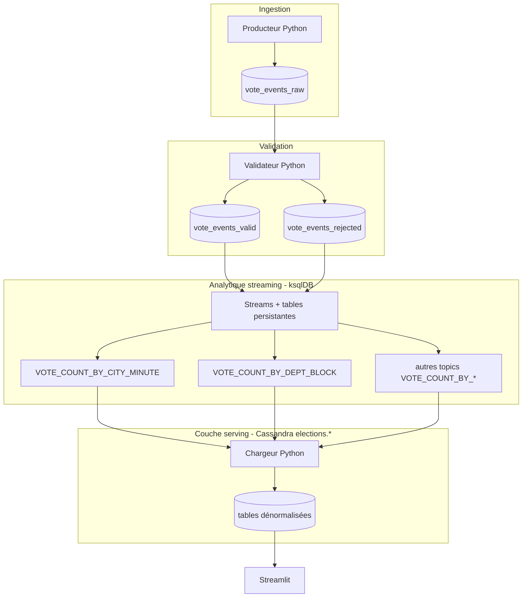
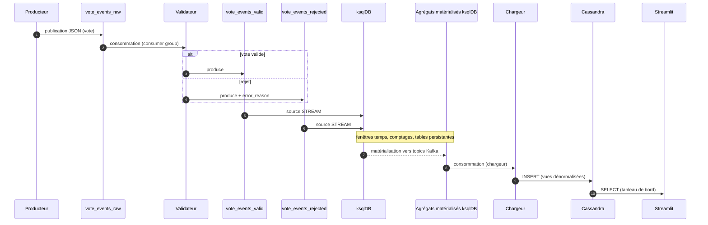
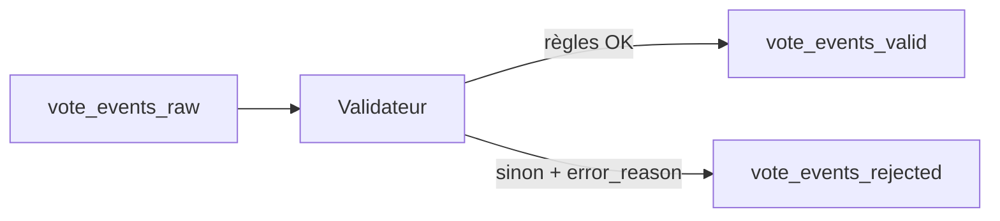
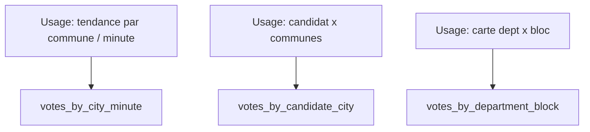

# SUJET D’EXAMEN — Projet Kafka  
## Élections municipales en temps réel

Ce livrable est un **projet de data engineering** : vous enchaînez ingestion événementielle, qualité des données, transformations en flux continu, stockage analytique orienté requêtes et restitution (tableau de bord).

**Modalités** : le travail attendu est décrit dans chaque partie du sujet ci-dessous et dans les fichiers `enonce/` (repères `TODO`).

Respecter l’ordre des exercices.

---

## Avant de commencer

### Prérequis machine

- **Docker** et **Docker Compose** installés, avec droits suffisants pour lancer les conteneurs.
- **Python 3.10+** recommandé.
- La stack est **exigeante** : prévoir **au moins 8 Go de RAM** utilisables pour Docker.

    Si les services restent « unhealthy », bouclent sur des redémarrages ou restent lents : fermer des applications lourdes ou augmenter la mémoire allouée à Docker (paramètres Docker Desktop).

### Répertoire de travail

Toutes les commandes `docker compose` du sujet supposent que le terminal courant est **à la racine du livrable** (répertoire qui contient `docker-compose.yml`).

### Shell : Linux / macOS / Windows

- **Linux / macOS** : après `python3 -m venv .venv`, activer avec `source .venv/bin/activate`.
- **Windows (PowerShell)** : `.venv\Scripts\Activate.ps1`
- Pour reproduire **exactement** les commandes bash du sujet, **WSL2** + une distribution Linux est fortement recommandé sous Windows.

### Parcours minimal (GO / NO GO)

Ne pas enchaîner les exercices tant que l’étape précédente n’est pas validée.

| Étape | GO si… |
|-------|--------|
| Stack Docker | `docker compose -f docker-compose.yml ps` : `kafka`, `ksqldb`, `cassandra` au moins **en cours d’exécution** (Cassandra peut mettre 1 à 2 minutes à devenir prêt). |
| Données | Fichiers présents sous `data/` après `generate_votes_data.py`. |
| Topics | La liste des topics contient les quatre noms attendus (voir exercice 3). |
| Flux 4–5 | Messages sur `vote_events_raw`, puis séparation visible entre valide et rejeté. |
| ksqlDB | Script SQL exécuté sans erreur bloquante ; contrôles possibles (`SHOW TABLES`, etc.). |
| Cassandra | Des lignes apparaissent dans les tables **lorsque** le pipeline amont tourne ou a récemment alimenté les topics. |

### Terminaux : rôle de « Terminal 1 », « Terminal 2 », etc.

Dans le sujet, **Terminal 1**, **Terminal 2**, … signifient des **fenêtres ou onglets séparés**, pour des programmes qui **restent actifs** (contrairement aux commandes ponctuelles qui se terminent seules).

| Terminal | Commande typique | Le garder ouvert ? |
|----------|------------------|---------------------|
| **Terminal 1 — producteur** | `python enonce/src/producer_votes.py` | **Oui** pendant les tests en flux continu (exercices 4 à 8). Arrêt avec `Ctrl+C` si vous voulez libérer la session (ou utilisez `MAX_MESSAGES=500` pour un run limité). |
| **Terminal 2 — validateur** | `python enonce/src/validator_votes.py` | **Oui**, en parallèle du producteur dès l’exercice 5 ; **indispensable** pour alimenter ksqlDB et le chargeur aux exercices 6–8. |
| **Terminal 3 — chargeur Cassandra** | `python enonce/src/load_to_cassandra.py` | **Oui** pendant les tests de l’exercice 7 (et 8 si vous rechargez encore) : ce script **tourne en boucle** et **ne revient pas tout seul au prompt** — c’est le comportement attendu. `Ctrl+C` pour l’arrêter. |
| **Terminal 4 — Streamlit** | `streamlit run enonce/src/dashboard_streamlit.py` | **Oui** tant que vous consultez le tableau de bord (exercice 8). |
| **Ponctuel** | `kafka-console-consumer`, exécution du `.sql` ksqlDB, application du schéma CQL | **Non** : la commande finit (ou vous l’interrompez après vérification) ; pas besoin de la maintenir ouverte en parallèle des autres. |

**À partir de l’exercice 6**, prévoir **au minimum** :

- un terminal pour le **producteur** ;
- un pour le **validateur** (tous deux laissés ouverts).

Pour l’exercice 7, ajouter le **chargeur**. Pour l’exercice 8, lancer **Streamlit** (tableau de bord), ou relancer le chargeur dans un terminal si vous l’aviez fermé.

### Reprise : topics déjà créés, second passage ksqlDB

- **Topics Kafka** : si `kafka-topics --create` indique que le topic existe déjà, soit vous **ignorez** l’erreur si la config convient, soit vous recréez la stack (`docker compose down` + volumes, **données perdues dans les conteneurs**).

    Les commandes de référence utilisent `--if-not-exists` pour éviter l’erreur en reprise.

- **ksqlDB** : un second passage du fichier SQL peut échouer avec des objets **déjà existants**.

    En cas de blocage : session interactive (`SHOW STREAMS;`, `DROP STREAM …`) selon les besoins, ou repartir d’une stack propre — voir les modalités de la session en cas de doute.

---

# Partie A — Rappels

## Contexte

Une cellule de supervision suit une élection municipale numérisée en quasi temps réel sur plusieurs communes : indicateurs à jour, données fiables (pas de KPI pollués par des votes invalides), traçabilité des rejets, lecture par commune, département et bloc politique.

Les votes arrivent en flux continu depuis plusieurs canaux :

- borne en mairie (`booth`) ;
- terminal assisté (`assist_terminal`) ;
- canal numérique (`mobile`).

Le système à mettre en œuvre traite des événements en continu : ingestion, contrôle, agrégation, stockage pour consultation, restitution sous forme de tableau de bord.

## Données

- **Événements** — fichier généré `data/votes_municipales_sample.jsonl` (une ligne JSON = un vote).

    Champs utiles : `vote_id`, `event_time`, `city_code`, `department_code`, `region_code`, `candidate_id`, `signature_ok`, `channel`, `ingestion_ts`.

- **Candidats** — `data/candidates.csv` : identifiants autorisés, nuance (`party`), bloc (`political_block`).

    Analyse **par bloc** ou **par parti** (couleurs différentes selon le type de graphique).

- **Territoire** — `data/communes_fr.json` (ou échantillon fourni) : codes INSEE, rattachement département, base pour la carte.

## Objectif technique

Mettre en place un pipeline : **Kafka** (ingestion live, validation) → **ksqlDB** (agrégations en continu) → **Cassandra** (tables orientées lecture) → **Streamlit** (visualisation).

## Vue d’ensemble du pipeline (rôle des composants)

Lecture de la chaîne sous l’angle **ingénierie des données** :

| Couche | Rôle typique |
|--------|----------------|
| **Kafka** | Bus d’événements : transport fiable des faits bruts et des flux qualifiés (journal / *event log*). |
| **Validateur** | **Data quality** sur le flux : rejets traçables, KPI basés sur le flux valide uniquement. |
| **ksqlDB** | **Transformation en continu** (ETL/ELT streaming) : fenêtres, comptages, matérialisation vers des topics typés « agrégats ». |
| **Cassandra** | **Couche serving** : tables **prêtes pour des lectures ciblées** (voir ci-dessous), alimentées par le chargeur depuis les topics d’agrégats. |
| **Streamlit** | **Couche présentation** : consomme surtout Cassandra (peu de calculs lourds côté application). |

Ce n’est pas un entrepôt relationnel classique (pas de schéma en étoile normalisé dans une seule base SQL ici), mais l’esprit est le même côté **consommation** : des **vues matérialisées** prêtes pour le reporting.

## Accès aux services

| Service   | URL |
|-----------|-----|
| Kafka UI  | [http://localhost:8080](http://localhost:8080) |
| ksqlDB    | [http://localhost:8088](http://localhost:8088) |
| Streamlit | [http://localhost:8501](http://localhost:8501) |

## Chaîne de traitement

1. Producteur Python → topic `vote_events_raw`.
2. Validateur → `vote_events_valid` et `vote_events_rejected`.
3. ksqlDB → streams, tables d’agrégats, topics matérialisés (`VOTE_COUNT_BY_*`). **Notamment** `VOTE_COUNT_BY_DEPT_BLOCK`, créé par ksqlDB — **à ne pas** créer à la main sur Kafka.
4. Chargeur Python → tables Cassandra `elections.*` (**modèle dénormalisé**, une table par besoin de requête).
5. Tableau de bord Streamlit → lecture prioritaire depuis Cassandra.

## Vue d’ensemble (infrastructure)

### Architecture macro (composants et topics)



Les topics `VOTE_COUNT_BY_*` (y compris `VOTE_COUNT_BY_DEPT_BLOCK`) sont **créés par ksqlDB** à partir des flux valides / rejetés ; **ne pas** les créer à la main sur Kafka.

### Flux temporel (séquence)



### Validation (chemins valide / rejet)



### Modèle Cassandra orienté requêtes (extraits)



## Cassandra : couche analytique et modèle dénormalisé

Dans un **entrepôt de données** classique (SQL), on modélise souvent des faits et des dimensions, puis on **dénormalise** volontairement des tables de fait ou des agrégats pour accélérer les requêtes BI (moins de jointures au moment de la lecture).

**Cassandra** ici joue le rôle d’une **base analytique orientée lecture** (*serving layer*) :

- Vous définissez **une table par type de requête** que le tableau de bord (ou un autre outil de restitution) doit pouvoir interroger rapidement.
- Le modèle est **dénormalisé** : les mêmes mesures peuvent exister dans plusieurs tables si les **chemins d’accès** (clé de partition, colonnes de clustering) diffèrent — c’est voulu, pas une erreur de conception.
- En production, chaque requête doit cibler une **clé de partition** connue. Éviter les parcours complets (`ALLOW FILTERING`, scans larges) : le schéma suit les **besoins de lecture** du sujet, pas l’inverse.

**ksqlDB** produit des agrégats en flux ; le **chargeur** les écrit dans Cassandra sous forme de tables **dénormalisées**, pour des `SELECT` simples côté tableau de bord.

## Tables Cassandra attendues (principe)

Une lecture efficace fixe la clé de partition ; éviter les parcours complets de la base en production.

- `votes_by_city_minute` : lecture par commune, historique par minute.
- `votes_by_candidate_city` : lecture par candidat, répartition par commune et temps.
- `votes_by_department_block` : lecture par département, votes par bloc (carte).

Exemples de requêtes **ciblées** (adapter les codes à vos données) — chacune correspond au **design** de la table (pas de jointure inter-tables à la volée) :

```sql
SELECT * FROM elections.votes_by_city_minute WHERE city_code='75056' LIMIT 50;
SELECT * FROM elections.votes_by_candidate_city WHERE candidate_id='C01' LIMIT 50;
SELECT * FROM elections.votes_by_department_block WHERE department_code='75';
```

## Fichiers à compléter

**Fichiers fournis** (non attendus comme livrables modifiés, sauf consigne de la session) : `enonce/src/generate_votes_data.py`, `docker-compose.yml`.

| Exercice | Fichier(s) |
|----------|-------------|
| 1–3 | Mise en route — aucun fichier sous `enonce/` à modifier pour ces exercices |
| 4 | `enonce/src/producer_votes.py` |
| 5 | `enonce/src/validator_votes.py` |
| 6 | `enonce/sql/ksqldb_queries.sql` |
| 7 | `enonce/cql/schema.cql`, `enonce/src/load_to_cassandra.py` |
| 8 | `enonce/src/dashboard_streamlit.py` |

---

# Partie B — Travail demandé

Les exercices **1 à 8** se suivent. Pour chaque exercice vous trouvez ci-dessous : **sujet**, **commandes** (à lancer depuis la racine du livrable), **contrôle**, **rendu**, ainsi que les repères `TODO` dans les fichiers `enonce/`.

**Dès qu’il y a du code ou du SQL à livrer** (exercices 4 à 8, et tout fichier `enonce/` modifié) : **(1)** compléter les `TODO` dans le ou les fichiers concernés ; **(2)** lancer les **commandes** de l’exercice (venv activé, Docker démarré, bons terminaux pour le flux si besoin) ; **(3)** joindre au livrable les **fichiers sources** modifiés ; **(4)** joindre des **captures d’écran** (terminal, Kafka UI, ksqlDB, navigateur Streamlit, etc.) ou extraits texte prouvant le contrôle. Le **compte rendu** par exercice suit le modèle en annexe.

À partir de l’**exercice 6**, laisser tourner en parallèle le **producteur** et le **validateur** pour alimenter ksqlDB et le chargeur Cassandra. Voir le tableau **Terminaux** en début de document : deux terminaux minimum, souvent trois avec le chargeur, quatre avec le tableau de bord (Streamlit).

---

## Exercice 1 — Environnement local

**Sujet** : environnement Python actif, dépendances installées, stack Docker démarrée, services `kafka`, `ksqldb`, `cassandra` joignables.

**Commandes** :

```bash
python3 -m venv .venv
source .venv/bin/activate
pip install -r enonce/requirements.txt
docker compose -f docker-compose.yml up -d
docker compose -f docker-compose.yml ps
```

*Équivalent condensé (même effet, après création du venv) :*

```bash
python3 -m venv .venv && source .venv/bin/activate && pip install -r enonce/requirements.txt
docker compose -f docker-compose.yml up -d
docker compose -f docker-compose.yml ps
```

**Contrôle** : `docker compose ps` ; Kafka UI et ksqlDB accessibles. Si Cassandra met du temps à démarrer, attendre puis relancer `docker compose ps`.

**Rendu** : compte rendu (modèle en annexe) ; **capture recommandée** : sortie de `docker compose ps` ou équivalent montrant les services attendus.

---

## Exercice 2 — Données de référence

**Sujet** : générer les fichiers sous `data/` et vérifier leur présence.

Le script `enonce/src/generate_votes_data.py` est fourni ; vous n’avez pas à le modifier pour ce sujet (sauf consigne contraire de la session).

Il écrit toujours dans le dossier **`data/` à la racine du livrable** (au même niveau que `docker-compose.yml`), quel que soit le répertoire courant du terminal.

**Commandes** (lancer depuis la **racine du livrable** pour que `ls data` corresponde) :

```bash
python enonce/src/generate_votes_data.py
ls data
python -c "import json; print(json.loads(open('data/votes_municipales_sample.jsonl', encoding='utf-8').readline())['vote_id'])"
```

**Contrôle** : présence de `votes_municipales_sample.jsonl`, `candidates.csv`, `communes_fr.json` ; `vote_id` affiché non vide.

**Rendu** : compte rendu ; réponses sur le rôle de `vote_id`, `signature_ok`, `city_code` ; **capture optionnelle** : terminal après `ls data` ou première ligne JSON lue.

---

## Exercice 3 — Topics Kafka

**Sujet** : créer les topics `vote_events_raw`, `vote_events_valid`, `vote_events_rejected`, `vote_agg_city_minute` avec le partitionnement indiqué dans le sujet :

- **6 partitions** pour les trois premiers topics ;
- **3 partitions** pour `vote_agg_city_minute` (topic **manuel** ; les agrégats ksqlDB matérialisent d’autres noms, ex. `VOTE_COUNT_BY_CITY_MINUTE` — ne pas les confondre).

Le topic `VOTE_COUNT_BY_DEPT_BLOCK` sera créé par ksqlDB plus tard.

**Commandes** — création des quatre topics puis liste (`--if-not-exists` évite l’erreur si le topic existe déjà) :

```bash
docker compose -f docker-compose.yml exec kafka bash -c \
  'kafka-topics --create --if-not-exists --topic vote_events_raw --partitions 6 --replication-factor 1 --bootstrap-server localhost:9092'
docker compose -f docker-compose.yml exec kafka bash -c \
  'kafka-topics --create --if-not-exists --topic vote_events_valid --partitions 6 --replication-factor 1 --bootstrap-server localhost:9092'
docker compose -f docker-compose.yml exec kafka bash -c \
  'kafka-topics --create --if-not-exists --topic vote_events_rejected --partitions 6 --replication-factor 1 --bootstrap-server localhost:9092'
docker compose -f docker-compose.yml exec kafka bash -c \
  'kafka-topics --create --if-not-exists --topic vote_agg_city_minute --partitions 3 --replication-factor 1 --bootstrap-server localhost:9092'
docker compose -f docker-compose.yml exec kafka bash -c \
  'kafka-topics --bootstrap-server localhost:9092 --list'
```

Vérification du partitionnement (exemple) :

```bash
docker compose -f docker-compose.yml exec kafka bash -c \
  'kafka-topics --describe --topic vote_events_raw --bootstrap-server localhost:9092'
```

**Contrôle** : la liste contient les quatre noms ; la description de `vote_events_raw` indique **6** partitions.

**Rendu** : compte rendu ; **capture recommandée** : sortie `kafka-topics --list` / `--describe` ou capture Kafka UI listant les quatre topics.

---

## Exercice 4 — Producteur (`enonce/src/producer_votes.py`)

**Sujet** : implémenter un producteur **live**.

- Ne pas utiliser le fichier `votes_municipales_sample.jsonl` comme source d’émission en continu.
- Publier sur `vote_events_raw` avec une clé Kafka pertinente (ex. `city_code`).

**Travail** (détail dans le fichier, `TODO` 0 à 5) :

- **TODO 0** et **TODO 4** : communes + événement JSON complet (champs attendus par la suite du pipeline) ;
- **TODO 1** et **TODO 2** : dans la boucle `main`, clé et valeur Kafka avant `produce` ;
- **TODO 3** (optionnel) : rythme d’envoi ;
- **TODO 5** (avancé) : profil territorial non uniforme ;
- `MAX_MESSAGES` permet d’arrêter après N messages sans mode « lecture fichier ».

**Commandes** :

Terminal 1 :

```bash
python enonce/src/producer_votes.py
# ou : MAX_MESSAGES=500 python enonce/src/producer_votes.py
```

Terminal 2 :

```bash
docker compose -f docker-compose.yml exec kafka bash -c \
  "kafka-console-consumer --bootstrap-server localhost:9092 --topic vote_events_raw --from-beginning --max-messages 5"
```

**Contrôle** : messages JSON visibles sur `vote_events_raw`.

*Remarque :* ici le **second terminal** sert au **contrôle** (`kafka-console-consumer`). Ce n’est **pas encore** le validateur de l’exercice 5.

Le tableau **Terminaux** en début de document décrit la configuration **complète** (producteur + validateur en parallèle) à partir de l’exercice 5.

**Rendu** :

1. Compléter les `TODO` dans `enonce/src/producer_votes.py`, puis lancer les **commandes** ci-dessus.
2. **Code** : fichier `producer_votes.py` (version finale).
3. **Preuve** : **capture(s)** du terminal (`kafka-console-consumer` ou messages visibles) et/ou **capture Kafka UI** sur le topic `vote_events_raw` (extraits JSON lisibles).
4. Compte rendu (annexe) : commandes utilisées, résultat, commentaire court.

---

## Exercice 5 — Validateur (`enonce/src/validator_votes.py`)

**Sujet** :

- consommer `vote_events_raw` ;
- appliquer les règles (signature, candidat connu, `vote_id` non vide) ;
- écrire sur `vote_events_valid` ou `vote_events_rejected` avec `error_reason` pour les rejets.

Les indicateurs métier se fondent sur le flux **valide**.

**Travail** : voir `TODO` 1 à 3 dans le fichier.

**Commandes** — garder le **producteur** (exercice 4) actif dans un autre terminal, puis :

```bash
python enonce/src/validator_votes.py
```

Contrôle optionnel sur les rejets (second terminal ponctuel) :

```bash
docker compose -f docker-compose.yml exec kafka bash -c \
  "kafka-console-consumer --bootstrap-server localhost:9092 --topic vote_events_rejected --from-beginning --max-messages 10"
```

**Contrôle** : les deux topics de sortie reçoivent des messages ; les rejets portent une raison.

*Tant que les `TODO` d’écriture Kafka ne sont pas implémentés, le validateur peut rester quasi silencieux après le message « Validateur démarré… » — c’est normal.*

**Rendu** :

1. Compléter les `TODO` dans `enonce/src/validator_votes.py` ; garder le **producteur** actif ; lancer `python enonce/src/validator_votes.py` et les contrôles Kafka utiles.
2. **Code** : fichier `validator_votes.py` (version finale).
3. **Preuve** : **capture(s)** montrant du trafic sur `vote_events_valid` et sur `vote_events_rejected` (console ou Kafka UI), avec au moins un rejet affichant une `error_reason` si votre jeu de test en produit.
4. Compte rendu (annexe) : règles appliquées + **brève justification** sur le calcul des KPI (valides vs rejetés).

---

## Exercice 6 — ksqlDB (`enonce/sql/ksqldb_queries.sql`)

**Sujet** :

- streams sur `vote_events_valid` et `vote_events_rejected` ;
- tables d’agrégats (candidat, fenêtre minute par ville, rejets par raison, agrégat **département × bloc** `vote_count_by_dept_block`).

Ne pas créer manuellement le topic `VOTE_COUNT_BY_DEPT_BLOCK` dans Kafka.

**Champs dans le flux valide**

Pour agréger par **département** et **bloc politique**, les messages JSON sur `vote_events_valid` doivent contenir les informations nécessaires (par ex. `department_code` et un champ de bloc cohérent avec `data/candidates.csv`, souvent nommé `candidate_block` dans ksqlDB).

Pensez à les **ajouter dans le producteur** (communes + table des candidats) et/ou à **enrichir l’événement dans le validateur** avant réécriture sur le topic valide.

**Travail** : voir `TODO` 1 à 7 dans le fichier.

**Prérequis** : producteur et validateur en cours d’exécution.

**Avant la première exécution du fichier** : le `.sql` fourni ne contient au départ que des **modèles commentés**. Vous devez y ajouter vos **CREATE STREAM** / **CREATE TABLE** **non commentés**. Sinon la commande `ksql` peut se terminer « sans erreur » mais **aucun objet** n’apparaît dans ksqlDB (`SHOW STREAMS`, `SHOW TABLES` vides).

**Commandes** :

```bash
docker compose -f docker-compose.yml exec -T ksqldb ksql http://localhost:8088 < enonce/sql/ksqldb_queries.sql
```

**Session interactive pour contrôle** :

```bash
docker compose -f docker-compose.yml exec -it ksqldb ksql http://localhost:8088
```

Puis, dans ksqlDB : `SHOW TABLES`, `SHOW QUERIES`, `SELECT * FROM vote_count_by_dept_block EMIT CHANGES LIMIT 10`.

**Contrôle** : tables créées ; agrégats non vides si le flux valide est alimenté.

**Rendu** :

1. Compléter les `TODO` dans `enonce/sql/ksqldb_queries.sql` ; **producteur + validateur** actifs ; exécuter la commande `exec -T ksqldb ksql … < enonce/sql/ksqldb_queries.sql`.
2. **Code** : fichier `ksqldb_queries.sql` (version exécutable sans erreur bloquante).
3. **Preuve** : **captures** ou copie-coller des sorties (`SHOW TABLES`, `SHOW QUERIES`, au moins un `SELECT … LIMIT` pertinent sur une table d’agrégat).
4. Compte rendu (annexe).

---

## Exercice 7 — Cassandra (`enonce/cql/schema.cql` + `enonce/src/load_to_cassandra.py`)

**Sujet** :

- keyspace `elections`, tables `votes_by_city_minute`, `votes_by_candidate_city`, `votes_by_department_block` ;
- chargeur consommant au minimum les topics `VOTE_COUNT_BY_CITY_MINUTE` et `VOTE_COUNT_BY_DEPT_BLOCK` ;
- mapping des champs ksqlDB vers les colonnes Cassandra.

**Rappel** : chaque table matérialise une **vue dénormalisée** pour un **type de requête** du tableau de bord ; la clé de partition et l’ordre des colonnes de clustering doivent correspondre aux `WHERE` en lecture (section **Cassandra** ci-dessus).

**Travail** : voir les `TODO` dans chaque fichier (schéma puis loader).

**Avant `cqlsh < schema.cql`** : le fichier CQL fourni ne contient au départ que des **exemples commentés**. Ajoutez vos **CREATE** / **USE** **non commentés**, sinon Cassandra restera sans keyspace `elections` ni tables.

**Commandes** :

```bash
docker compose -f docker-compose.yml exec -T cassandra cqlsh < enonce/cql/schema.cql
python enonce/src/load_to_cassandra.py
```

Le chargeur **reste actif** (boucle infinie) :

- garder ce terminal ouvert pendant les tests ;
- arrêter avec `Ctrl+C` quand vous avez terminé (voir aussi **Terminaux** en début de document).

**Contrôle des lignes** :

```bash
docker compose -f docker-compose.yml exec cassandra cqlsh -e "SELECT count(*) FROM elections.votes_by_city_minute;"
docker compose -f docker-compose.yml exec cassandra cqlsh -e "SELECT count(*) FROM elections.votes_by_candidate_city;"
docker compose -f docker-compose.yml exec cassandra cqlsh -e "SELECT count(*) FROM elections.votes_by_department_block;"
```

**Contrôle** : tables peuplées lorsque le pipeline amont tourne.

**Rendu** :

1. Compléter les `TODO` dans `enonce/cql/schema.cql` puis dans `enonce/src/load_to_cassandra.py` ; appliquer le schéma avec `cqlsh` ; lancer le **chargeur** avec le pipeline amont (producteur + validateur + ksqlDB) actif.
2. **Code** : fichiers `schema.cql` et `load_to_cassandra.py` (versions finales).
3. **Preuve** : **capture(s)** des `SELECT count(*)` (ou équivalent) montrant des lignes dans les tables `elections.*`, ou sortie terminal.
4. Compte rendu (annexe).

---

## Exercice 8 — Tableau de bord (`enonce/src/dashboard_streamlit.py`)

**Sujet** : tableau de bord Streamlit (KPI, série temporelle, carte, tops, rejets), données issues principalement de Cassandra.

**Prérequis** : le **schéma Cassandra** de l’exercice 7 doit exister (keyspace `elections`). Le squelette se connecte tout de suite à Cassandra au lancement : sans étape 7, l’application peut planter avant même d’afficher la page.

Pour la carte, privilégier `votes_by_department_block` ; prévoir un repli si la table est vide.

**Règles d’affichage**

- Graphiques **par bloc** : couleurs par bloc (ECO rattaché au bloc gauche pour cette vue).
- Graphiques **par parti** : couleur par nuance (ex. ECO en vert).

Ne pas mélanger les deux conventions sur un même graphique.

**Travail** : voir les `TODO` dans le fichier — **1 à 6** (dont **4bis** pour le graphique par parti), plus **TODO 7** pour les blocs « top communes » et « top candidats ».

**Commandes** — avec **producteur**, **validateur** et **chargeur** actifs dans des terminaux séparés si vous voulez un flux à jour (voir **Terminaux** en début de document) :

```bash
streamlit run enonce/src/dashboard_streamlit.py
```

**Contrôle** : affichage cohérent avec les données présentes dans Cassandra.

**Rendu** :

1. Compléter les `TODO` dans `enonce/src/dashboard_streamlit.py` ; avec **producteur**, **validateur** et **chargeur** actifs si vous voulez un flux à jour ; lancer `streamlit run enonce/src/dashboard_streamlit.py`.
2. **Code** : fichier `dashboard_streamlit.py` (version finale).
3. **Preuve** : **capture(s)** de l’application dans le navigateur (KPI, graphiques par bloc et par parti, série temporelle, **tops** communes/candidats ; carte ou repli justifié si table vide).
4. Compte rendu (annexe) : choix d’affichage et lien avec les données Cassandra.

---

# Annexes

## Modèle de compte rendu (par exercice)

Joindre les **captures d’écran** ou extraits mentionnés dans la section **Rendu** de chaque exercice (fichiers image ou PDF à côté du compte rendu, ou intégrés au document selon les consignes de la session).

```text
Exercice n° :
Commandes exécutées et fichiers livrés (chemins sous enonce/) :
Résultat obtenu (référence aux captures jointes : ex. figure 1, annexe A) :
Commentaire court (2 à 3 lignes) :
```

## Liste de vérification

- [ ] Messages dans `vote_events_raw`.
- [ ] Séparation valide / rejeté.
- [ ] Tables ksqlDB et topics associés.
- [ ] Lignes dans Cassandra.
- [ ] Table `votes_by_department_block` utilisée ou justifiée si vide.
- [ ] Tableau de bord aligné avec les données.
- [ ] Choix techniques expliquables.

**Commandes utiles** :

```bash
docker compose -f docker-compose.yml exec kafka bash -c \
  "kafka-topics --bootstrap-server localhost:9092 --list"
docker compose -f docker-compose.yml exec cassandra cqlsh -e "SELECT count(*) FROM elections.votes_by_department_block;"
```

## Dépannage (symptômes courants)

| Symptôme | Cause fréquente | Action |
|----------|-----------------|--------|
| `kafka-topics` : topic already exists | Relance après création réussie | Utiliser les commandes avec `--if-not-exists`.<br>Ou ignorer si le topic est correct. |
| ksqlDB : already exists / stream exists | Second passage du script SQL | Session interactive : `DROP` ciblé ou stack propre (`down -v`). |
| `SHOW TABLES` / `SHOW STREAMS` vides après exécution du `.sql` | Fichier encore entièrement commenté | Ajouter des **CREATE** **non commentés** dans `ksqldb_queries.sql`, puis réexécuter (ou repartir stack propre si besoin). |
| `cqlsh` « OK » mais pas de tables `elections.*` | `schema.cql` sans instructions actives | Décommenter / ajouter **CREATE KEYSPACE**, **USE**, **CREATE TABLE** réels dans `schema.cql`. |
| Cassandra : Connection refused | Conteneur pas prêt | `docker compose ps` ; attendre 1–2 min ; relancer si besoin. |
| Tableau de bord vide, compteurs à 0 | Pas de flux ou chargeur arrêté | Vérifier **producteur + validateur** en cours.<br>Charger avec `load_to_cassandra.py` **ouvert** ; laisser quelques secondes. |
| `RuntimeError` au lancement du producteur (TODO 1 / 2) | Clé ou valeur encore à `None` | Renseigner **TODO 1** (bytes UTF-8) et **TODO 2** (`json.dumps` + `.encode("utf-8")`) dans `producer_votes.py`. |
| Validateur sans activité visible | Rien sur `vote_events_raw` ou producteur incomplet | Côté **producteur** : **TODO 0, 4** puis **TODO 1 et 2** (clé bytes, valeur JSON). Côté **validateur** : **TODO 2 et 3** pour réémettre vers les topics valide / rejeté. Vérifier `producer.flush()` côté validateur si peu de messages. |
| `load_to_cassandra` « ne rend pas la main » | Comportement normal | Boucle infinie : `Ctrl+C` pour quitter. |
| Port 8080 / 8088 / 8501 / 9092 déjà pris | Autre service sur la machine | Arrêter l’autre application.<br>Ou adapter les ports dans `docker-compose.yml` (non requis pour valider le sujet tel quel). |
| Commandes Docker : service cassandra introuvable | Mauvais répertoire ou nom de projet | `cd` vers la racine du livrable.<br>`docker compose ps` doit lister `cassandra`. |
